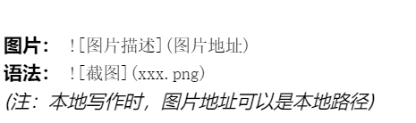

标题：使用 # 号来表示标题，# 越少标题越大`(最多支持六级)`
# 一级标题
## 二级标题
### 三级标题
#### 四级标题
##### 五级标题
###### 六级标题


**加粗文本**
*斜体文本*
***加粗并斜体***
~~删除体~~


三个反斜杠用来写多行内容，示例如下`用于重点突出内容`
```
这里放置代码块之类的
import os
print("helloworld")
```


`flag{test}` <-- `单个反斜杠` 这个用来写一行以内的内容

列表：使用 - 或 * 或 + 加空格
- 步骤一：抓包
- 步骤二：分析流量
  - 子项：查找 HTTP 请求 (前面加两个空格缩进)
* 12345
* 123
  
  *
+ 123232132
+ 213124
  
  +


有序列表： 使用 数字. 加空格

1. 这是第一点
2. 这是第二点
3. 这是第三点

任务列表：
- [x] 213 `这块的内部填写的就是字母x，不打勾不用写`
- [ ] 34

超链接的写法：[显示文本]（链接）

[CTF Wiki](https://ctf-wiki.org)

![图片描述]（图片地址）
 

`此处在一个文件夹下直接复制文件名就可以了`


引用:用于引用题目描述或特别提示

> 这是一段引用文本
> > 这是嵌套引用


下面是一段表格

| 漏洞类型 | 难度 | 备注 |
| :--- | :---: | ---: |
| SQL注入 | 中等 | 左对齐 |
| RCE | 高 | 居中 |
| XSS | 低 | 右对齐 |

分割线
用于分隔不同部分的题解。
---
语法： --- 或 ***
***


```
作为 CTF 选手，你不需要把 Markdown 玩出花来，只需要熟练使用以下组合拳：

# 写题目名称。
## 写解题步骤。
``` 贴 Payload 和 Python 脚本。
> 引用题目原本的提示信息。
![image] 贴运行截图
```